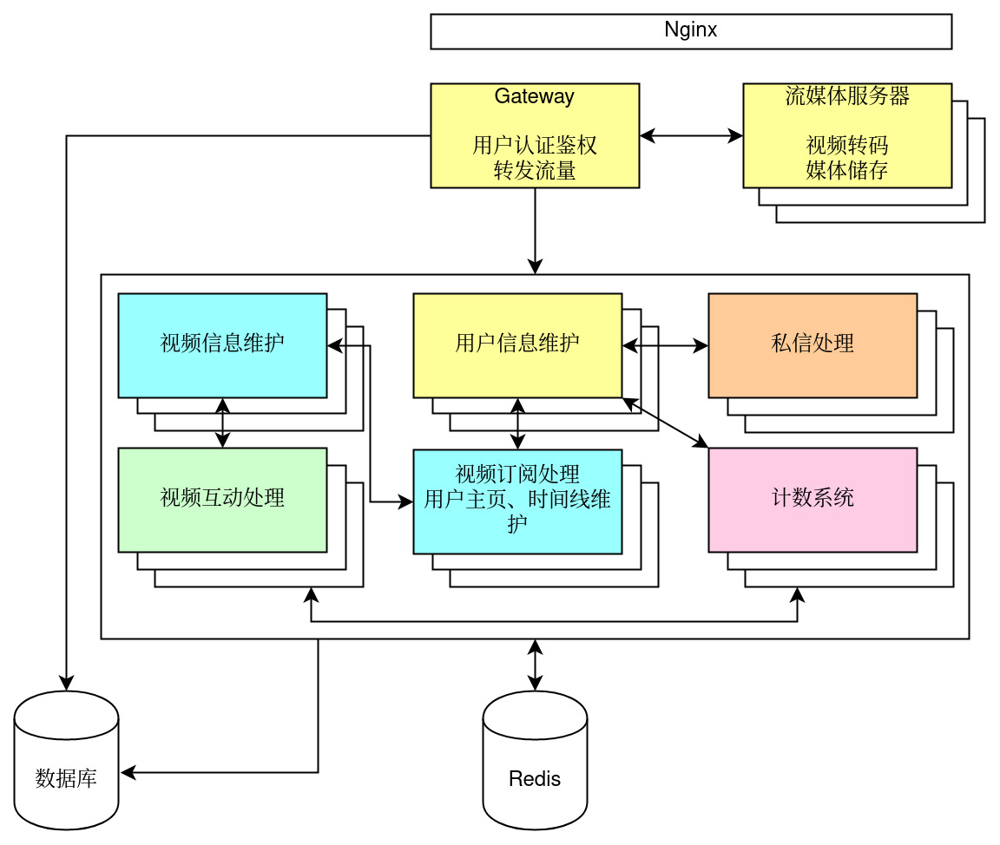

# mdouyin - A Micro Douyin Implmentation

## 一、项目介绍

一个基于微服务架构的微型抖音后端实现

## 三、项目实现

### 3.1 技术选型与相关开发文档

1. 项目使用 **Go** 语言开发：

   相比起其它语言，Go 语言原生支持用户态线程，且后端软件相关库的生态系统发达。

2. 项目使用 **Hertz** 与 **Kitex** 框架：

   作为微服务的后端架构，HTTP 与 RPC 的相关框架是必不可少的。这两者都支持 Thrift 代码生成，可以减少 boilerplate 代码，避免复制粘贴产生的奇妙错误，并通过 IDL 帮助协作交流。

3. 使用 **Cassandra** 储存实现推模式的 Feed 流架构：

   Feed 流架构复杂。
   虽然方案说明中并没有明确的对已登录用户的 Feed 流的要求，但我们认为，基于日常的理解，“Feed 流是由已关注用户的稿件组成的按一定顺序排序的视频列表”。在查阅一些资料后，我们认为推模式相比拉模式：(1) 对数据库的读压力更小，(2) 数据库更易水平扩展（如分库分表），(3) 升级为推拉结合的架构也相对更容易。

   Cassandra 等 NoSQL 的选用则是基于数据库水平扩展以及大 V 用户发视频时的写入量的需求（虽然演示以及实际的小项目中应该达不到这种数据量）。

4. 使用 **JWT** 进行 token 生成与校验：

   用户 token 校验如果经数据库的话，则对数据库读压力较大。
   项目要求里并没有要求用户注销（这是 JWT 的难点之一），因此用户 token 非常适于用 JWT 生成。这样可以避免校验对数据库的大量读操作，相对的它会有一定的计算量（但比起 Argon2 应该还好）。

   另一个可能的解决方案是使用数据库记录 token 过期或登出的状态，配合缓存，但限于时间和人手不足等原因项目里并没有加入缓存。

5. 使用 **MySQL** 等 RDBMS 储存：

   用户信息、关注信息等需要较强的一致性，并且有二级索引（如用户名）的需求。
   虽然这一部分也可能会在非常非常高数据量的情况下有瓶颈，但一般的 NoSQL 较难实现二级索引，Cassandra 的数据一致性也不太理想。因此这里使用 MySQL 等 RDBMS 的传统解决方案。

6. 使用 **etcd** 配合 Kitex 社区的相关库实现服务注册与发现：

   横向扩展微服务时需要自动进行服务注册与发现。
   提供服务注册与发现功能的软件不仅仅有 etcd，但是 etcd 使用 Go 实现，更轻量级也更易整合到 Go 的系统中去。

7. 使用 **Snowflake ID** 算法，配合 etcd 进行节点 ID 生成：

   Cassandra 储存不具备高效的递增唯一 ID 的生成方法。
   在 1024 个节点（一些库可调）以下时，Snowflake ID 算法可以实现总体递增的全局唯一 ID。前提：

   1. 时钟不发生回拨；
   2. 各个节点的 ID 均小于 1024 且互不相同。

   我们通过阅读代码确定我们使用的库对运行时的回拨进行了处理（调用会阻塞直至时间赶上）；我们未处理程序未运行时的回拨问题。
   针对第二个前提，我们可以利用 **etcd** 提供的分布式 CAS 实现全局的唯一节点 ID 分发。

   另外，Snowflake ID 本身就可以提供一个毫秒级别的创建时间戳，这已经可以满足本次项目的时间数据需求了。

8. 使用 **Argon2id** 算法进行用户密码加密：

   用户密码必须要经过 hash + salt 处理。
   Argon2id 是相对较新且较受认可的密码加密算法，能够较好地防止被拖库时用户密码被破解的情况。

9. 引入 **zap** 进行日志记录，并配合 Hertz、Kitex 的社区相关库：

   实际项目中 Go 的 log 库不足以满足多级日志等需求。
   Zap 支持多级日志，且速度较快，支持 JSON 的输出格式以方便实际运维时进一步自动化处理日志。

10. 使用相关库对 magic number 进行校验，再使用 **ffmpeg** 进行操作：

    服务需要对上传的视频作校验并生成封面图片。
    校验分为 magic number 的轻度校验以及 ffmpeg 的开销相对较大的校验。另外，ffmpeg 可以提取关键帧、找出画面变化较大的帧作为封面。

11. (未) 引入 MQ 进行削峰、中间数据保存和传递：

    在推模式推送、视频校验等耗时操作时可能出现负载过大、宕机后数据不一致等情况。

    限于时间和人手不足等原因项目里并没有加入消息队列。

12. (未) 使用第三方结合 CDN 的储存服务：

    视频的上传流量大，阅览的下载流量也极大。

    大流量的静态内容的分发可以通过 CDN 极大地缓解服务器的压力。个人而言，我更倾向于让客户端直接上传到 S3 （用 signed url 等）然后再用后台的任务进行校验（如果错误就封号？），省得网关再费流量和临时储存去转发。如果有转码需求可能还需要考虑 worker 机或是分布式文件系统等。但项目要求的 API 的话这个流量肯定需要经过网关了。

    限于时间、金钱和人手不足等原因项目里并没有对接 S3 或是 CDN 服务而是直接使用了本地储存。

13. 使用 **Docker** ，实现在开发机上编译镜像、在云服务器部署的操作：

    服务好多，依赖的数据库之类的也好多，部署麻烦。
    买的云服务器跑不动编译。

    我们可以用 docker 来将自动将项目编译并打包成为镜像；结合 Docker Compose 我们可以自动化部署流程。再加一些手动操作（或者利用私有 repo）我们可以实现在开发机上编译、在云服务器上利用打包好的镜像直接部署这样的操作。

### 3.2 架构设计

根据功能的不同进行微服务划分，项目最初的架构大致如下：



因为考虑到了人手问题，所以最初大致按上图的颜色分为了五个部分。因为当初考虑进行几次迭代，在后续再进行缓存、消息队列的加入，因而各部分的架构和代码也较为简单。但是后续因为组员极低的参与度，人手不足，架构就留在了这个样子。

### 3.3 项目代码介绍

#### 3.3.1 目录结构

项目代码按上面的架构分为五个微服务和一部分公共代码，不同服务放在各自目录下，用 go.work 组织起来。各部分理论上均可横向扩展（除  counter 和 gateway 外其它服务均为无状态，这两个有本地缓存）。

1. common: 公共代码，包括 Kitex 生成代码、统一的错误代码（复制自阿里的 Java 规范）和 etcd 注册等 utility。
   1. common/snowy: 对一个 Snowflake ID 的封装，加入了利用 etcd 分布式生成唯一节点 ID 的初始化过程。另外还有一些工具函数用来在 ID 和时间戳之间作转换。
   1. common/utils: 一些工具函数以及统一的错误代码、错误处理等内容。
1. 下面的各微服务的代码目录分布大多都遵从这些逻辑：
   1. internal/cache: 对缓存的初始化以及相关操作封装。
   1. internal/cql: 包括 Cassandra 数据库相关的初始化、操作以及 DO 的相关操作、转换等封装。
   1. internal/db: 包括关系数据库相关的初始化、操作以及 DO 的相关操作、转换等封装。
   1. internal/services: 对 Kitex 客户端的初始化。
1. gateway: 网关，简便起见负责了媒体储存、用户信息校验、部分的数据合并等功能。
   1. gateway/internal/jwt: 对 JWT 库进行了一些封装，包括使用环境变量初始化 HMAC 密钥、在 Hertz 下使用 JWT 的工具函数等。
   1. gateway/internal/videos: 对视频文件存盘和 ffmpeg 操作的封装，负责管理媒体储存、校验视频以及生成封面图片。
1. counter: 计数器，对关注者/粉丝数、点赞/评论数进行计数，横向扩展时在缓存有效期间会存在计数误差，在不宕机的情况下可以保证最终一致性。
   1. counter/db: 可以说是用了奇怪的 atomic 操作实现的一套计数缓存存盘方案吧。
1. feeder: Feed 部分，管理视频元信息，并实现了推模式的 Feed 流。
1. message: 私信处理。
1. reaction: 视频互动处理，管理点赞、评论信息。

#### 3.3.2 RPC 接口

RPC 接口方面，RPC 定义基本和外部 HTTP API 一模一样，除了：
1. Token 变成了 RequestUserId，强制 gateway 进行认证处理。
1. counter 有对应的增减、请求 RPC 接口。
1. 一些服务添加了一系列的请求信息接口，由 gateway 把信息合并：
1. feeder: 获取一系列视频的详细信息。（和点赞列表等合并）
1. message: 获取一系列用户各自的最新一条消息。（和互关的消息列表合并）
1. reaction: 判断一系列视频里有哪些被当前用户所点赞。（和 Feed 流合并）

## 四、测试结果

### 4.1 功能测试

因为大多数功能都需要多个有关注关系的用户、多个 token 进行，所以这里使用 Python 脚本编写测例。（另外需要注意的是 Snowflake ID 已经超过了 JavaScript 可以安全表示的整数范围，所以例如 Firefox 浏览器里显示的 JSON 里的 ID 大概率是错误的，命令行 jq 的提取结果也是错误的，如果想要手动测试的话可以考虑查看 Raw JSON。）
测试脚本在 https://github.com/yesh0/mdouyin/blob/main/tests/batch_test.py ，包括了所有 API 端口的基础测试。

测试结果如下：

```
ubuntu:~/mdouyin/tests$ python batch_test.py
 Running test_user_info(0):
   Test registering and retrieving info.
        ok
 Running test_user_info(1):
   Test registering and retrieving info.
        ok
 Running test_user_info(2):
   Test registering and retrieving info.
        ok
 Running test_follow_list(0):
   Test follow, follower listing.
>>>> Running nested test_relation(0):
>>>>   Test following, unfollowing and counters.
        ok
        ok
 Running test_follow_list(1):
   Test follow, follower listing.
>>>> Running nested test_relation(1):
>>>>   Test following, unfollowing and counters.
        ok
        ok
 Running test_follow_list(2):
   Test follow, follower listing.
>>>> Running nested test_relation(2):
>>>>   Test following, unfollowing and counters.
        ok
        ok
 Running test_video_publish(0):
   Test video publishing, listing and feed.
>>>> Running nested test_relation(3):
>>>>   Test following, unfollowing and counters.
        ok
        ok
 Running test_video_reaction(0):
   Test video reaction listing and counters.
>>>> Running nested test_video_publish(1):
>>>>   Test video publishing, listing and feed.
>>>>>>>> Running nested test_relation(4):
>>>>>>>>   Test following, unfollowing and counters.
        ok
        ok
        ok
 Running test_friend_message(0):
   Test friend listing and messages.
        ok
```

### 4.2 性能测试

使用 JMeter 测试，对应文件在 https://github.com/yesh0/mdouyin/blob/main/tests/Test%20Plan.jmx 。

下面的测试里，服务器 2.50GHz 单核 2 GB 内存 SSD 硬盘，五个微服务和 Redis, Cassandra, etcd, MariaDB 都跑在上面（Cassandra 堆大小设成了 512 MB，MariaDB 没有特意去控制内存）。（这个机器甚至不够内存来编译……）JMeter 跑在我自己机器上，ping 延迟是 8 ms 左右，所以大致可以忽略延迟的影响。

1. 在大量请求的情况下很多请求都超时失败了，下面的结果是把并发降下来之后测的（从 50 到 100 并法线程不等）。
1. 另外未经缓存的使用了 Cassandra 的 API 的确是写入速度大于读取速度（标黄色的两个测试一个读一个写）。
1. 而加了缓存的读操作的接口速度也快很多；相比之下，因为大部分的写操作接口（除了部分附带的校验外）都直接落到数据库了，所以写操作的瓶颈大概还是数据库。这方面可能可以通过后续引入操作队列来压峰以及异步化来解决。
表格里绿色的是有缓存的。点赞系统会用缓存来过滤重复的点赞/取消请求，所以压测里的大多数点赞或者取消点赞的操作都会被判定为重复操作，不会实际写入数据库。
1. 那四个失败的请求看起来是超时了。

请见 https://eaer709jtb.feishu.cn/docx/RCWJdFcfhoYxeOx65bjcPjvNnzb

五、Demo 演示视频 （必填）
中间有一次“用户重复请求”应该是客户端 Feed 流界面没有刷新造成的，原先已经关注了、点过赞了的，但是 Feed 界面保留了登陆前的没有点红心的状态，返回刷新之后才显出出当前登陆用户的 Feed 流。
消息部分会有一次回显，看起来是客户端在发消息时没有把 pre_msg_time 更新……要消息记录多端共通的话，这部分去重或是更新操作应该放到客户端做吧……

请见 https://eaer709jtb.feishu.cn/docx/RCWJdFcfhoYxeOx65bjcPjvNnzb

## 六、项目总结与反思

1. 目前仍存在的问题：
    1. 测例没有专门去测试 edge cases。
    1. 完全是手动部署，大部分配置也仍是硬编码。
    1. 计数系统太依赖缓存了（用了些花里胡哨的 atomic），在宕机时会有部分数据丢失。
    1. 点赞计数的增加和实际点赞记录的写入是分开的，并没有用各种事务保证原子性。
1. 已识别出的优化项
    1. 缓存使用较少。
    1. 部分数据库的表格设计还需进一步优化，一些没有遵循主键递增，一些可能使用软删除更好。
    1. 架构演进的可能性
    1. 将媒体储存、处理甚至转码等工作交给第三方的 S3 以及 CDN 服务，或是让客户端直接上传至 S3（使用 signed url，也许要结合封号机制来防止滥用）。
    1. 加入消息队列，对大 V 的发布进行削峰缓冲。
    1. 采用推拉结合的 Feed 流实现，对粉丝量大的大 V 采取拉模式。这里的拉模式的对应的数据也需要相应加入缓存。
1. 项目过程中的反思与总结
    1. 团队沟通很重要？最好要先保证队员能够都看到飞书的消息？

## 七、其它补充资料

### 7.1 实现项目时的青训营笔记

1. Feed 流架构设计 | 青训营笔记 - 掘金
1. Snowflake ID 相关阅读 | 青训营笔记 - 掘金
1. 使用 etcd 分配全局唯一节点 ID | 青训营笔记 - 掘金
1. Zookeeper 相关笔记 | 青训营笔记 - 掘金
1. 点赞功能实现思路阅读 | 青训营笔记 - 掘金
1. 使用 JMeter 压测项目 | 青训营笔记 - 掘金
1. 使用 Docker Compose 远端部署项目 | 青训营笔记 - 掘金

# TODO

- [X] User API:
  - [X] Registration
  - [X] Logging-in
  - [X] Info:
    - [X] Basic Info
    - [X] Assemble relationship data & counters (e.g. follower count)
- [X] Feed API:
  - [X] Assemble counter data (e.g. like/comment counts)
  - [X] Publish: Uploads a video, generates its cover image,
    and pushes the info to followers' inboxes.
  - [X] Feed viewing: Lists one's inbox.
  - [X] Listing: Lists one's submissions.
- [X] A counter service
- [X] Reaction API
- [X] Chat API

## Bugs

- [X] The app does not seem to receive the correct feed:
  a user obviously has an empty feed, but the app stil shows something.
  Probably the app has some kind of internal cache such that it merges all feeds?
- [ ] File uploading is really slow.
- [ ] Argon2 is really memory-intensive. We should rate-limit registrations and logins.
  Otherwise the gateway will get killed for using too much memory.

## Improvements

- [ ] Uploaded files is either kept fully in memory or stored to the disk temporarily.
  However, if it is stored as a temporary file, we should want move it in place instead
  of copying it.
- [ ] Cache.
